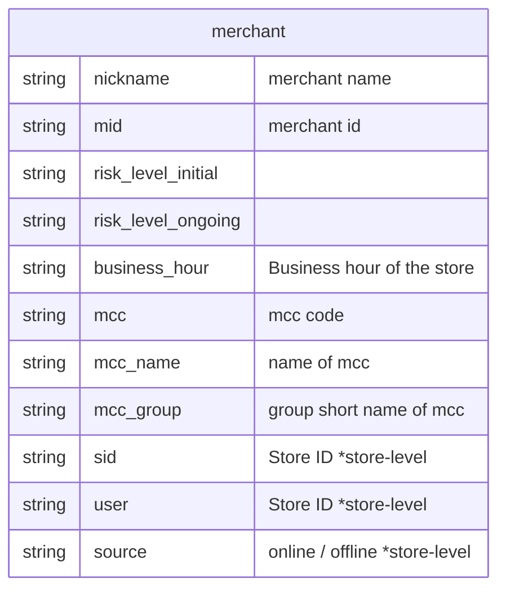
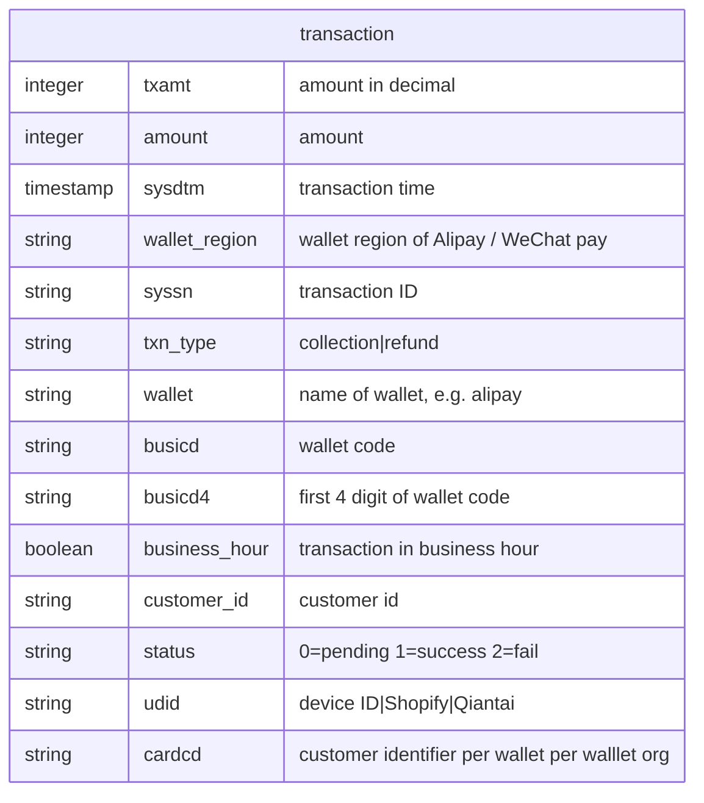
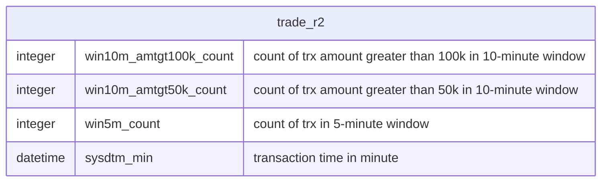
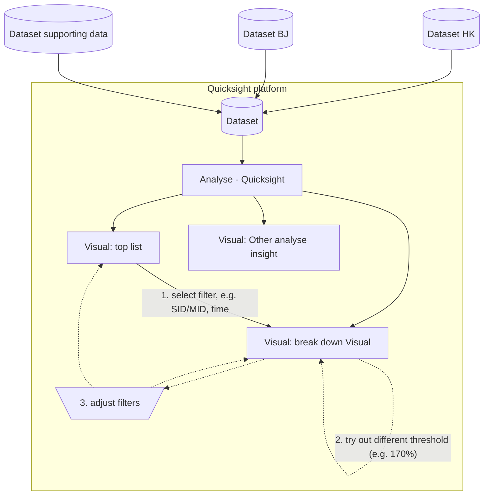

# Data dictinoary

## trade_v1 dataset
`trade_1` is the raw transaction data (`trade_v1`). Every row represents a single transaction.

## trade_r2 dataset
`trade_r2` is the transaction data group by **ONE MINUTE** of the raw transaction data (`trade_v1`). 
`trade_r2` is an extended dataset **based on `trade_v1`**, more data, more custom columns are added.

# Analyse idea

