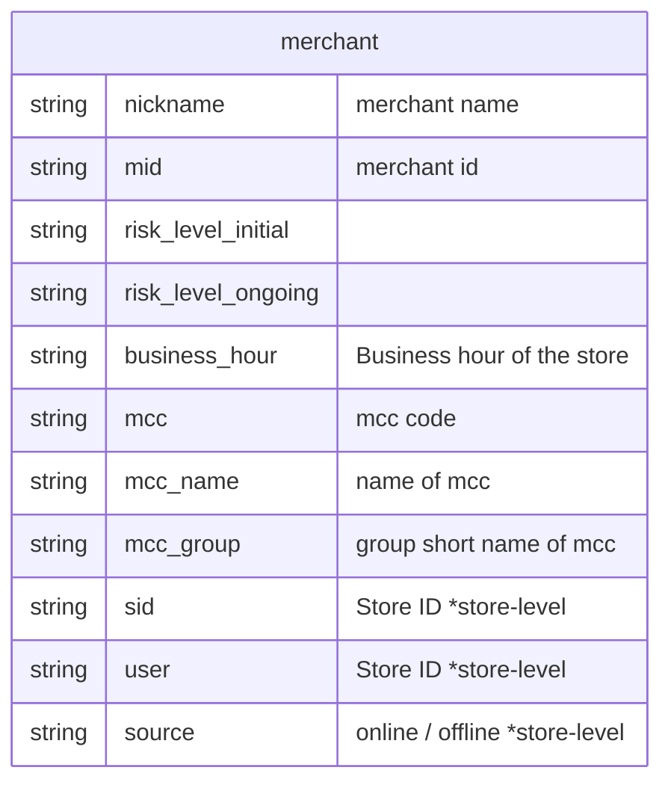
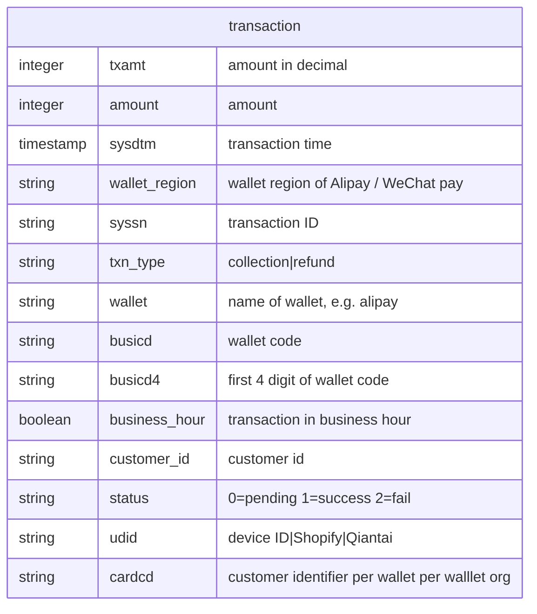
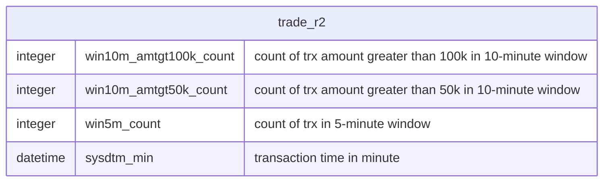
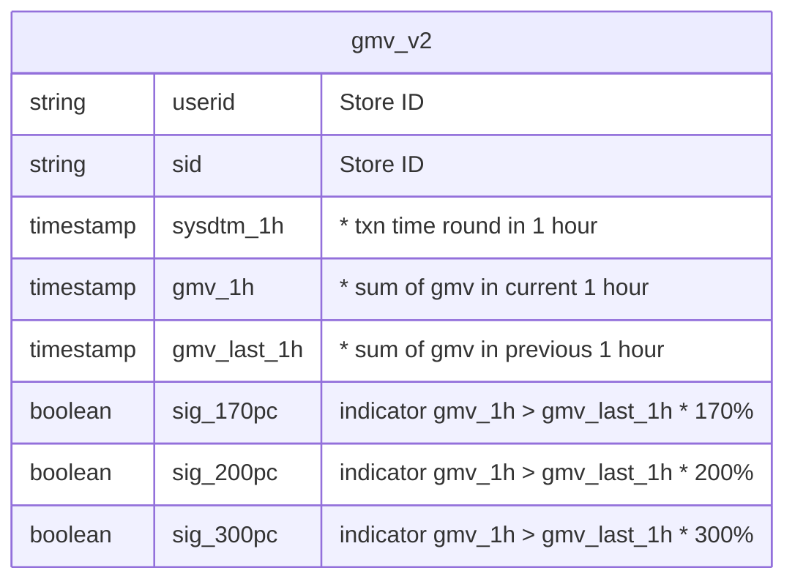
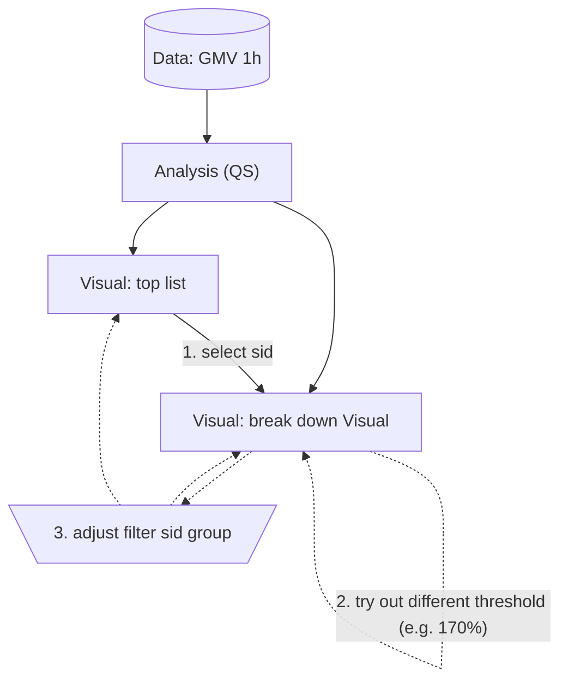
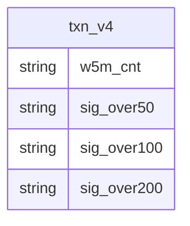

# common data

```mermaid
erDiagram
  merchant {
   string nickname "merchant name" 
   string mid "merchant id"

    string risk_level_initial
    string risk_level_ongoing

    string business_hour "Business hour of the store"

    string mcc "mcc code"
    string mcc_name "name of mcc"
    string mcc_group "group short name of mcc"

    string sid "Store ID *store-level"
    string user "Store ID *store-level"

    string source "online / offline *store-level"
  }
```

```mermaid
erDiagram
  transaction {
    integer txamt "amount in decimal"
    integer amount "amount"
    timestamp sysdtm "transaction time"
    string wallet_region "wallet region of Alipay / WeChat pay"

    string syssn "transaction ID"
    string txn_type "collection|refund"

    string wallet "name of wallet, e.g. alipay"
    string busicd "wallet code"
    string busicd4 "first 4 digit of wallet code"

    boolean business_hour "transaction in business hour"
    string customer_id "customer id"

    string status "0=pending 1=success 2=fail"

    string udid "device ID|Shopify|Qiantai"
    string cardcd "customer identifier per wallet per walllet org"
  }
```

# rule 2 data

```mermaid
erDiagram
  trade_r2 {
    integer win10m_amtgt100k_count "count of trx amount greater than 100k in 10-minute window"
    integer win10m_amtgt50k_count "count of trx amount greater than 50k in 10-minute window"

    integer win5m_count "count of trx in 5-minute window"

    datetime sysdtm_min "transaction time in minute"
  }
```

# rule 7 data

```mermaid
erDiagram
  gmv_v2{
    string userid "Store ID"
    string sid "Store ID"
    timestamp sysdtm_1h "* txn time round in 1 hour"
    timestamp gmv_1h "* sum of gmv in current 1 hour"
    timestamp gmv_last_1h "* sum of gmv in previous 1 hour"
    boolean sig_170pc "indicator gmv_1h > gmv_last_1h * 170%"
    boolean sig_200pc "indicator gmv_1h > gmv_last_1h * 200%"
    boolean sig_300pc "indicator gmv_1h > gmv_last_1h * 300%"
  }
```

# rule 7 analysis

```mermaid
graph TD
    d[(Data: GMV 1h)] --> a["Analysis (QS)"]
    a --> tl[Visual: top list]
    a --> bd[Visual: break down Visual]
    tl -->|1. select sid| bd
    bd -.-> |"2. try out different threshold (e.g. 170%)"| bd

    bd -.-> adjust[\3. adjust filter sid group/]
    adjust -.-> bd
    adjust -.-> tl
```

# rule 2 data

```mermaid
erDiagram
  txn_v4 {
    string w5m_cnt
    string sig_over50
    string sig_over100
    string sig_over200
  }
```
