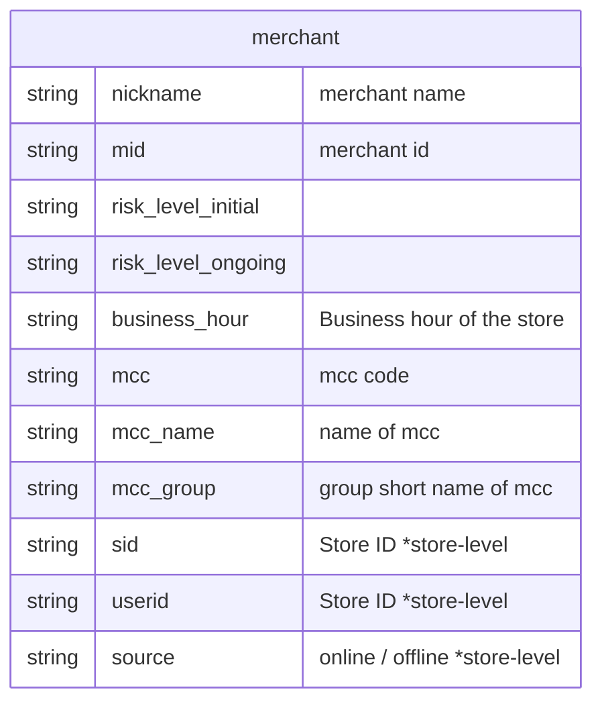
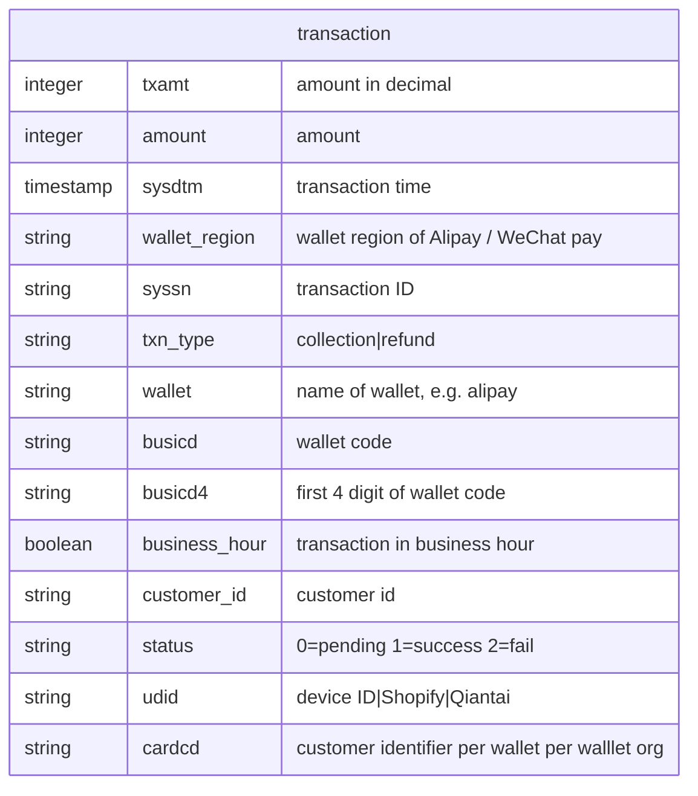
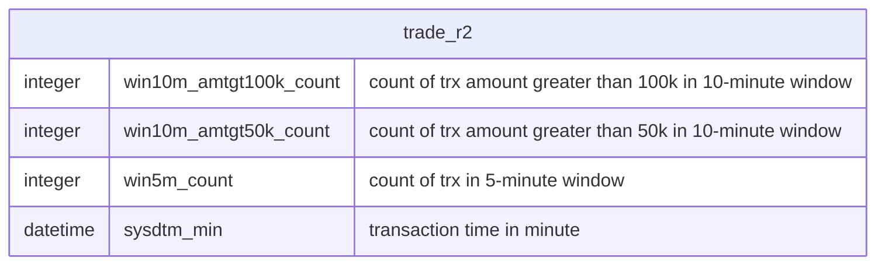
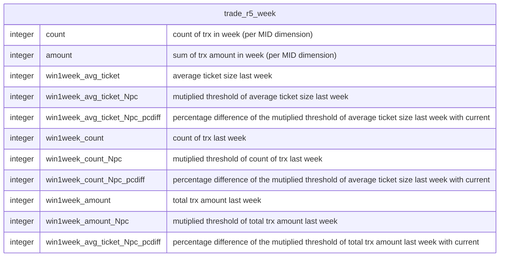
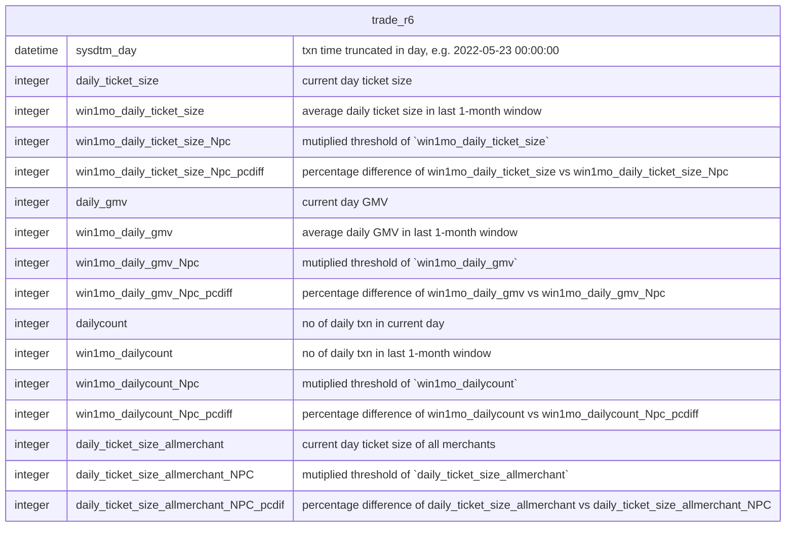
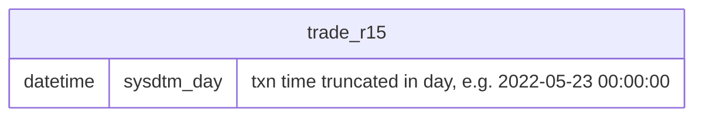
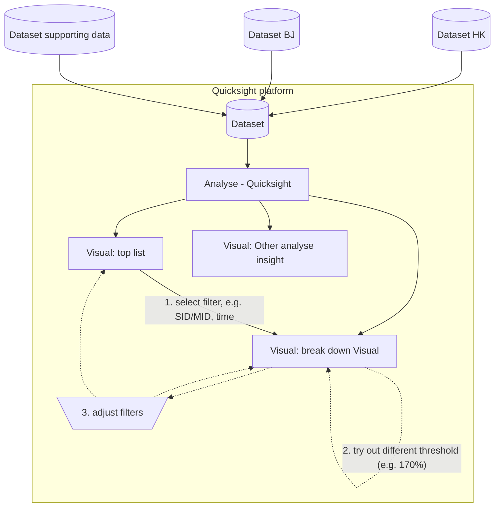

# Data dictionary

## trade_v1 dataset
`trade_1` is the raw transaction data (`trade_v1`). Every row represents a single transaction.

## trade_r2 dataset
`trade_r2` is the transaction data group by **ONE MINUTE** of the raw transaction data (`trade_v1`). 
`trade_r2` is an extended dataset **based on `trade_v1`**, more data, more custom columns are added.

## trade_r5_week dataset (weekly grouped ONLY for demo purpose)
`trade_r5_week` is the transaction data group by **ONE WEEK** of the raw transaction data (`trade_v1`). 
`trade_r5_week` is an extended dataset **based on `trade_v1`**, more data, more custom columns are added.

** the correct dataset `trade_r6` will be added.
`trade_r6` is the transaction data group by **ONE DAY** of the raw transaction data (`trade_v1`).

## trade_r6 dataset
`trade_r6` is the transaction data group by **ONE DAY** of the raw transaction data (`trade_v1`).
`trade_r6` is an extended dataset **based on `trade_v1`**, more data, more statistic columns in 1-month window are added.

## trade_r15 dataset
`trade_r15` is the transaction data grouped by same amount of the raw transaction data (`trade_v1`).

# Analyse idea

