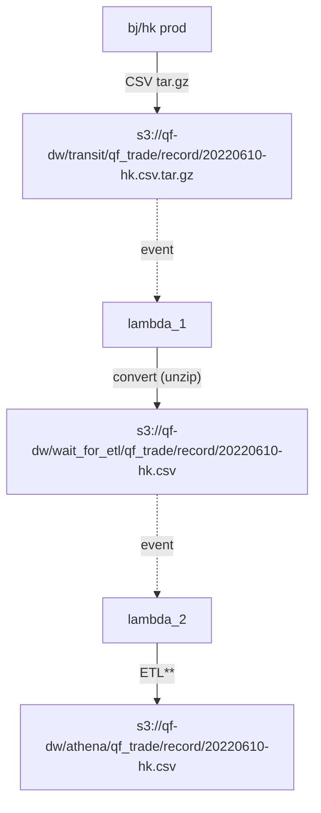

```mermaid
graph TD
    src["bj/hk prod"] --> |CSV tar.gz| s3_transit["s3://qf-dw/transit/qf_trade/record/20220610-hk.csv.tar.gz"]

    s3_transit -..-> |event| lambda_1

    lambda_1 --> |"convert (unzip)"| s3_etl["s3://qf-dw/wait_for_etl/qf_trade/record/20220610-hk.csv"]

    s3_etl -..-> |event| lambda_2

    lambda_2 --> |ETL**| s3_athena["s3://qf-dw/athena/qf_trade/record/20220610-hk.csv"]

```
